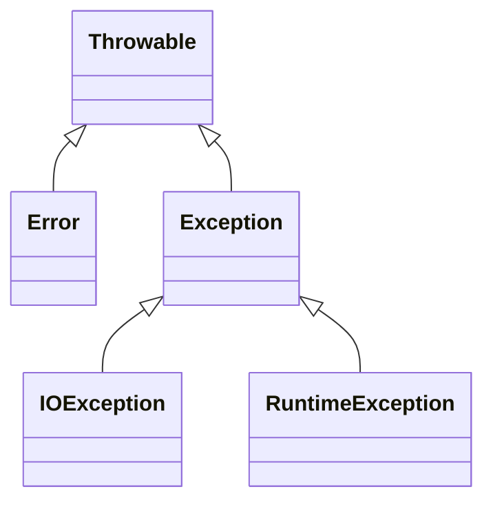

# 异常


## 异常分类

​	Java 中，异常类都是派生于 Throwable 类的，类图如下：



​	Error 类描述了 Java 运行时系统的内部错误和资源耗尽错误 ，应用程序不应该抛出这种类型的对象，因为出了这样的错误，除了通知用户并终止程序以外，无能为力

​	派生于 RuntimeException 的异常包括以下问题：

- 错误的强制类型转换
- 数组访问越界
- 访问 null 指针

​	不是派生于 RuntimeException 的异常包括：

- 超越文件末尾继续读取数据
- 打开一个不存在的文件

​	Java 语言规范将派生于 Error 类或 RuntimeError 类的所有异常称为非检查型异常，其他的异常称为检查型异常

```tip
RuntimeException 这个名字容易让人混淆，因为讨论的所有错误都发生在运行时
```

```tip
如果出现 RuntimeException 异常，一定是你的问题，因为都是可以通过代码设计来避免，所以不应该是检查型异常
```

```tip
子类不能抛出比超类更通用的异常，超类不抛出任何异常子类也不能抛出
```


## finally 子句

​	不管是否有异常被捕获，finally 子句中的代码都会执行，即使在 catch 子句中 return ，在那之前都会执行

```warning
当 finally 子句包含 return 语句时，有可能产生意想不到的结果，方法返回前会执行 finally 子句块，finally 块如果也有一个 return 语句，这个返回值将会遮蔽原来的返回值
```

```tip
finally 子句主要用于清理资源，不要把改变控制流的语句（return, throw, break, continue）放在 finally 子句中
```


## try-with-Resources 语句

​	如果资源属于一个实现了 AutoCloseable 接口的类，Java 7 为这种代码模式提供一个很有用的快捷方式，AutoCloseable 接口有一个办法：`void close() throws Exception`

```tip
还有一个 Closeable 接口，这是 AutoCloseable 的子接口，也只包含一个 close 方法，不过这个方法抛出一个 IOException
```

​	try-with-resources 语句的最简形式：

```java
try (Resources res = ...){
    work with res
}
```

​	Resources 可以有多个，无论这个块如何退出，所有的 Resources 都会关闭

```note
如果用常规方式手动编程，要是有两个 Resources ，就需要两个嵌套的 try/finally 语句，并且调用 close 方法也可能抛出异常，如果原来也有异常，close 的异常就会被抑制
```


## 分析堆栈轨迹元素

​	堆栈轨迹中某个特定点上所有挂起的方法调用的一个列表，使用 Throwable 类的 printStackTrace 方法可以访问堆栈轨迹的文本描述信息

​	一种更灵活的方法是使用 StackWalker 类，它会生成一个 StackWalker.StackFrame 实例流，每个实例分别描述一个栈帧，可以利用 StackWalker 对象的 forEach 方法或者使用懒方式处理 `Stream<StackWalker.StackFrame>` 调用 walk 方法

​	下面是一个输出递归阶乘程序的堆栈的程序：

```java
public class StackTraceTest {

    public static int factorial(int n) {
        System.out.println("factorial(" + n + "):");
        StackWalker walker = StackWalker.getInstance();
        walker.forEach(System.out::println);	// 这里调用 System.out::println 输出堆栈信息
        int r;
        if (n <= 1) r = 1;
        else r = n * factorial(n - 1);
        System.out.println("return " + r);
        return r;
    }

    public static void main(String[] args) {
        try (Scanner in = new Scanner(System.in)){
            System.out.println("Enter n:");
            int n = in.nextInt();
            factorial(n);
        }
    }

}
```

