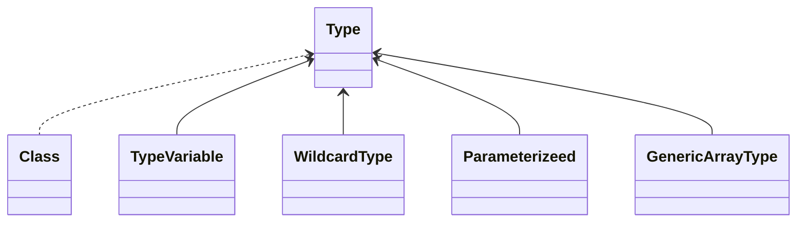

# 泛型


## 类型擦除

无论何时定义一个泛型类型，都会自动转换成相应的原始类型，类型变量被擦除，替换成限定类型，无限定类型则替换为 Object

例如， Pair\<T\> 的原始类型如下所示：

```java
public class Pair {
    private Object first;
    ...
	public void setSecond(Object newValue) { second = newValue; }
}
```

```tip
如果擦除了一个泛型方法的返回类型，编译器就会插入强制类型转换
```

 	方法的擦除带来两个复杂问题，下面这个示例：

```java
// 继承于 Pair<LocalDate> ，并且重写了 setSecond 和 getSecond 方法
class DateInterval extends Pair<LocalDate> {
    
    public void setSecond(LocalDate second) {
        ...
    }
    
    public LocalDate getSecond() { return (LocalDate) super.getSecond(); }
}
```

擦除以后就变成：

```java
class DateInterval extends Pair {	// 继承原始类型了
    
    public void setSecond(LocalDate second) {
        ...
    }
    
    public LocalDate getSecond() { return (LocalDate) super.getSecond(); }
}
```

但是还有一个从 Pair 继承的 setSecond 方法，即：

```java
public void setSecond(Object second)
```

这看上去是不同的方法，因为它有一个不同类型的参数—— Object ，而不是 LocalDate， 但是它们不应该不一样，这时候类型擦除与多态发生了冲突，为了解决这个问题，编译器会在 DateInterval 类中生成一个桥方法：

```java
public void setSecond(Object second) { setSecond((LocalDate) second); }
```

通过桥方法能够调用正确的 DateInterval 类中的 setSecond 方法

而对于 getSecond 方法也是会使用桥方法使用多态，但是此时在 DateInterval 类中，会有两个 getSecond 方法：

```java
LocalDate getSecond()
Object getSecond()	// 桥方法，会调用上面那个
```

实际上是不能这样编写 Java 代码的，两个方法有相同的参数类型是不合法的，但是在虚拟机中，会由参数类型和返回类型指定一个方法，因此编译器可以为两个仅返回类型不同的方法生成字节码，虚拟机能够正确处理这种情况

```note
桥方法不仅用于泛型类型，一个方法覆盖另一个方法时，可以指定一个更严格的返回类型，这其中其实也是使用了桥方法，例如编写了一个 clone 方法并返回具体类型，则会生成桥方法覆盖 Object 的 clone 方法调用这个新的 clone 方法 
```


## 类型变量的限定

一个类型变量或通配符可以有多个限定，例如：

```java
T extends Comparable & Serializable
```

```tip
可以根据需要拥有多个接口超类型，但最多有一个限定可以是类，并且必须是限定列表中的第一个限定
```

```note
类型擦除后， `T extends Comparable & Serializable` 会被用 Comparable 替换，而编译器会在必要的时候向 Serializable 插入强制类型转换，如果是 `T extends Serializable & Comparable` 那就会被 Serializable 替换，所以为了提高效率，应该将标签接口（没有方法的接口）放在限定列表的末尾
```


## 限制与局限性

	### 不能用基本类型实例化类型参数

没有 Pair\<double\> ，擦除之后含有 Object 类型的字段，而 Object 不能存储 double 值


### 运行时类型查询只适用于原始类型

所有的类型查询只产生原始类型：

```java
if (a instanceof Pair<String>)	// 错误
if (a instanceof Pair<T>)	// 错误
Pair<String> p = (Pair<String>) a;	// 警告：并不能检验 a 是 String 类型的 Pair，即使 a 不是，编译器也不会报错，直到运行时调用相关方法才会抛出 java.lang.ClassCastException 异常
```

同样的，调用 getClass 方法总是返回原始类型


### 不能实例化参数化类型的数组

例如：

```java
var table = new Pair<String>[10];	// 错误
var table = new Pair[10];	// 警告：虽然可以通过编译的，但是数组内存储的类型不能确定，不安全
```

为什么不行，任意数组是可以直接转换为 Object[] ，数组仍然会记住它的元素类型，如果试图存储其它类型的元素，就会抛出 ArrayStoreException 异常：

```java
var array = new Pair[10];
Object[] objarray = table;
objarray[0] = new Pair();	// 成功
objarray[0] = "Hello"	// 错误，数组元素类型应为 Pair
```

但是对于泛型类型，擦除使得这种机制无效：

```java
var table = new Pair<String>[10];	// 假设能过通过编译
Object[] objarray = table;
objarray[0] = new Pair<Integer>();	// 错误：虽然能够通过数组存储的检查但是仍然会导致一个类型错误
```

本质上是因为数组类型是**协变**的，即 String[] 可以赋值给 Object[]，但是泛型是**不可变**的，即不能够将 Pair\<String\> 赋值给 Pair\<Object\> ，这导致了冲突，所以在**实例化数组**的时候**不能**够带上**泛型**，否则实例化出来的泛型数组并**不符合数组的特性**（协变性），所以仅仅只是不能实例化的时候指定，但是声明**类型为 Pair\<String\>[] 的变量**仍然是**合法**的

``` note
如果还是想实例化泛型数组，可以使用通配符，然后进行强制类型转换：
`var table = (Pair<String[]) new Pair<?>[10];` 
由于 Pair<?> 建立的数组符合数组的特性，即接受任何类型的 Pair ，数组可以把它理解是 Pair<Object> ，所以能够创建成功，但是这个结果将不是安全的，往里存储 Pair<Employee> 也不会检查出错误，而是在运行时调用才会抛出 ClassCastException 异常（和数组一样）
```

```note
# <?> 与 原始类型
上面的效果通过直创建原始类型的数组再强转也是能实现，但是在引入泛型以后，使用原始类型是不被推荐的，实际上 <?> 的实现形式就是类型擦除以后相当于原始类型，但是泛型设计者为了类型安全在上面又进行了一些限制，比如不能够通过类型有 <?> 的引用进行参数类型的操作（比如往 List<?> 里添加元素），但是对于原始类型是可以，一般只在 .class 和 instanceof 的时候使用到原始类型，因为参数化类型在这个时候并没有用
```
```tip
实际上泛型的设计者就是想摒弃数组那种不安全的类型设计，但由于有遗留代码需要适配，所以才能用上面的方法创建不安全的泛型数组
```


### Varargs 警告

考虑下面这个方法，它的参数个数是可变的：

```java
public static <T> void addAll(Collection coll, T... ts) {
	for (T t : ts) coll.add(t);
}
```

实际上 ts 是一个数组，假设 T 为 Pair\<String\> ，为了调用这个方法，Java 虚拟机必须建立一个 Pair\<String\> 数组，这就违法了前面的规则，不过对于这种情况，规则有所放松，只会得到一个警告而不是错误

可以使用 `@SuppressWarnings("unchecked")` 或者 `@SafeVarargs` 注解来抑制这个警告

```tip
@SafeVarargs 只能用于声明为 static、final 或 private 的构造器和方法，所有其他方法都可能被覆盖，导致注解没什么意义
```

```note
可以使用这个 @SafeVarargs 注解使一个参数个数可变的方法返回泛型数组，消除创建泛型数组的限制，看起来很方便，不过隐藏着危险
```


### 不能实例化类型变量

不能再类似 `new T(...)` 表达式中使用类型变量，类型擦除将 T 变成 Object ，你肯定不希望调用 new Object()

Java 8 之后，最好的解决办法是让调用者提供一个构造器表达式，例如：

```java
Pair<String> p = Pair.makePair(String::new);
```

让 makePair 方法接收一个 Supplier\<T\>，调用其 get 方法即可返回类型变量实例

```note
比较传统的方法就是传给方法一个 class 对象，然后通过 class 类型的 getConstructor().newInstance() 方法创建实例
```

```tip
泛型数组也是一样，不能够使用 `new T[2]` 这样创建泛型数组，可以通过传入 `String[]::new` 数组构造器表达式生成正确类型的数组，传统方式同样使用反射，调用 `Array.newInstance` 方法
```


### 不能抛出或捕获泛型类的实例

不能抛出也不能捕获泛型类的对象，实际上，泛型类扩展 Throwable 甚至都是不合法的：

```java
public class Problem<T> extends Exception { ... }	// 不能正常编译
```

catch 子句不能使用类型变量：

```java
public static <T extends Throwable> void doWork () {
    try {
        ...
    }catch (T t) {	// 不能编译
        ...
    }
}
```


### 可以取消对检查型异常的检查

Java 中必须为所有检查型异常提供一个处理器，不过可以利用泛型取消这个机制，看下面这个接口：

```java
public interface Task {
    @SuppressWarnings("unchecked")
    static <T extends Throwable> void throwAs (Throwable t) throws T {
        throw (T) t;
    }
}
```

使用方式：

```java
try {
    do work
} catch (Throwable t) {
    Task.<RuntimeException>throwAs(t);
}
```

把所有异常都转换为编译器认为的非检查型异常

```note
有什么意义呢，正常情况下，必须捕获方法中的所有检查型异常，把它们“包装”到非检查型异常中，这里并没有做这种“包装”，只是抛出异常，“哄骗”编译器，让它相信这不是一个检查型异常（我认为是泛型的类型不安全导致可以直接强转）
```


### 注意擦除后的冲突

假定为 Pair 类增加一个 equals 方法，如下所示：

```java
public boolean equals(T value) { ... }
```

类型擦除后就变成 `equals(Object)` ，与 Object 的 equals 方法冲突，补救方法就是重新命名引发冲突的方法

如果两个接口类型是同一接口的不同参数化，一个类或者类型变量不能同时作为这两个接口的子类：

```java
class Employee implements Comparable<Employee> { ... }
class Manager extends Employee implements Comparable<Manager> { ... }	// 错误
```

但是以下非泛型版本是合法的：

```java
class Employee implements Comparable { ... }
class Manager extends Employee implements Comparable { ... }	// 合法
```

原因可能与桥方法有关，实现 Comparable\<X\> 的类会生成一个桥方法：

```java
public int compareTo(Object other) { return compareTo((X) other);}
```

不能拥有不同 X 的桥方法


## 通配符

- 使用了 extends 通配符的泛型方法，不能够写入，只能读取
- 使用了 super 通配符的泛型方法，可以写入，读取只会返回 Object 类型
- 使用了 ? 通配符的泛型方法，读取只会返回 Object 类型，写入只能用 null 当参数

```note
# extends 和 super 为什么会这样？
首先明确一点，返回值的数据类型要找上限，只有当返回值是绝对的父类时才能返回适配的其它子类，而方法参数的数据类型要找下限，因为只有传入绝对的子类时才能赋值给适配的其它父类
而在 extends 通配符下，可以知道父类即上限，所以可以读取，尽情的返回这个父类型就行，但是写入时不知道方法参数应该是什么类型
而对于 super 通配符，可以知道下限，所以可以写入，但是在读取的时候，只能将 Object 这个共有父类当作上限来返回了
? 其实也是一样，既没有上限也没有下限，所以读取只能返回 Object ，写入只能写 null 也合理
```

```tip
上面提到的是指这个泛型类需要操作成员变量，如果是不用操作成员变量只是泛型方法，在方法参数或者返回值中， extends 和 super 该怎么用就怎么用
```


## 捕获通配符

有一些方法需要临时保存方法的参数，比如一个交换元素的方法：

```java
public static void swap(Pair<? extends Number> p)
```

但是不能在代码中使用 " ? " 作为一种类型，也就是说下面的代码是非法的：

```java
? t = p.getFirst();	// 错误
p.setFirst(p.getSecond());
p.setSecond(t);
```

 	这是一个问题，因为交换的时候必须临时保存第一个元素，解决方法是写一个辅助方法 swapHelper ：

```java
public static <T> void swapHelper(Pair<T> p) {
    T t = p.getFirst();
    p.setFirst(p.getSecond());
    p.setSecond(t);
}
```

现在可以由 swap 调用 swapHelper：

```java
public static void swap(Pair<?> p){ swapHelper(p); }
```

这种情况下，swapHelper 方法的参数 T 捕获通配符

```tip
通配符捕获只有在非常限定的情况下才是合法的，编译器必须能够保证通配符表示单个确定的类型，例如 ArrayList<Pair<T>> 中的 T 永远不能捕获 ArrayList<Pair<?>> 中的通配符，因为数组列表可以保存多个 Pair<?>，其中 ? 可以分别有不同的类型
```


## 反射和泛型

对于这个方法：

```java
public static <T extends Comparable<? super T>> T min(T[] a)
```

为了表述泛型类型声明，可以使用 java.lang.reflect 包中的接口 Type ，这个接口包含以下子类型：

- Class 类型，描述具体类型
- TypeVariable 接口，描述类型变量（`T extends Comparable<? super T>`）
- WildcardType 接口，描述通配符（`? super T`）
- ParameterizedType 接口，描述泛型类或接口类型（`Comparable<? super T>`）
- GenericArrayType 接口，描述泛型数组（`T[]`）



