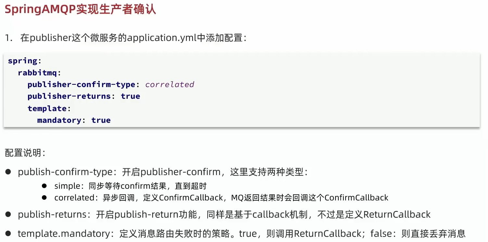
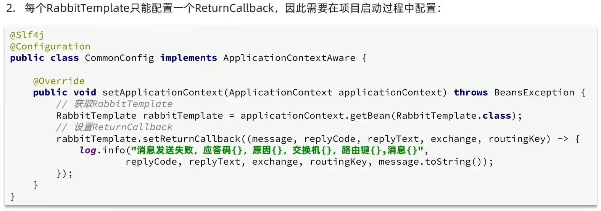
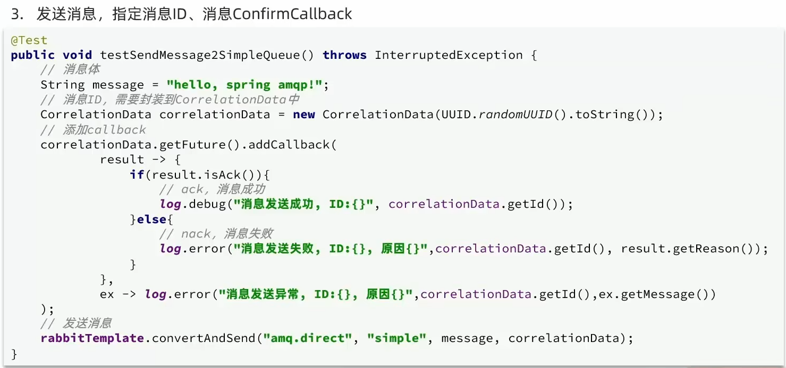
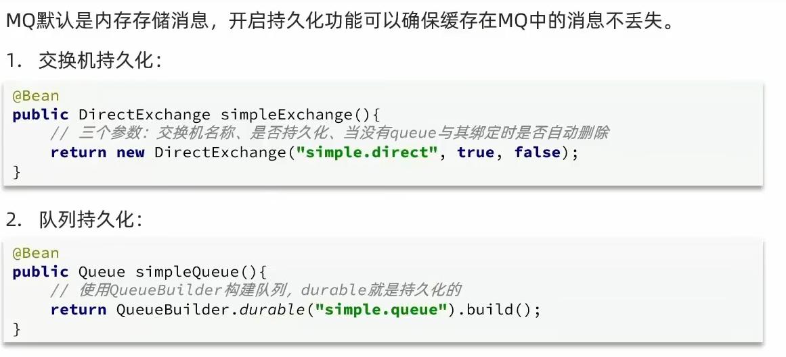
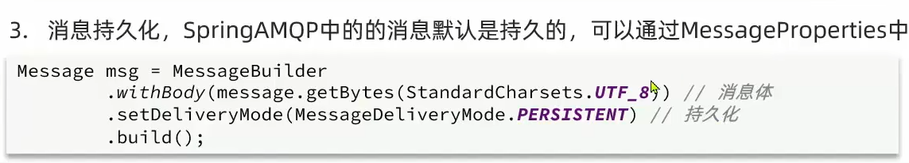
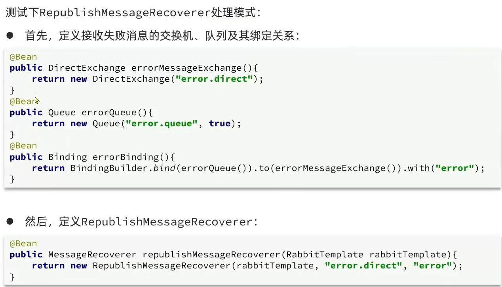
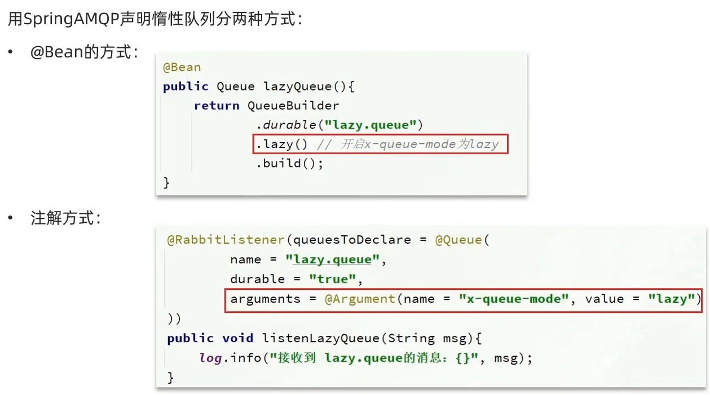

# MQ

​	同步通讯的缺点：

- 耦合度高：每次加入新的需求，都要修改原来的代码
- 性能下降：调用者需要等待服务提供者的响应，如果调用链过长则响应时间等于每次调用的时间之和
- 资源浪费：调用链中每个服务在等待响应过程中，不能释放请求占用的资源，高并发场景下会极度浪费系统资源
- 级联失败：如果服务提供者出现问题，所有调用方都会跟着出问题，如同多米诺骨牌一样，迅速导致整个微服务群故障

​	异步通讯的优点：

- 耦合度低
- 吞吐量提升
- 故障隔离
- 流量削蜂

​	异步通讯的缺点：

- 依赖于Broker的可靠性、安全性、吞吐能力
- 架构复杂了，业务没有明显的流程线，不好追踪管理


## 什么是MQ

​	MQ（MessageQueue），中文是消息队列，就是事件驱动架构中的Broker，常见的有下面几种实现：

|            |        RabbitMQ         |             ActiveMQ              |  RocketMQ  |   Kafka    |
| :--------: | :---------------------: | :-------------------------------: | :--------: | :--------: |
| 公司/社区  |         Rabbit          |              Apache               |    阿里    |   Apache   |
|  开发语言  |         Erlang          |               Java                |    Java    | Scala&Java |
|  协议支持  | AMQP，XMPP，SMTP，STOMP | OpenWire，STOMP，REST，XMPP，AMQP | 自定义协议 | 自定义协议 |
|   可用性   |           高            |               一般                |     高     |     高     |
| 单机吞吐量 |          一般           |                差                 |     高     |   非常高   |
|  消息延迟  |         微秒级          |              毫秒级               |   毫秒级   |  毫秒以内  |
| 消息可靠性 |           高            |               一般                |     高     |    一般    |


## RabbitMQ

​	RabbitMQ中的几个概念：

- channel：操作MQ的工具
- exchange：路由消息到队列中
- queue：缓存消息
- virtual host：虚拟主机，是对queue、exchange等资源的逻辑分组


​	RabbitMQ中常见消息模型：

- 基本消息队列（BasicQueue）
- 工作消息队列（WorkQueue）
- 发布订阅（Publish、Subscribe），又根据交换机类型不同分为三种：
  - Fanout Exchange：广播
  - Direct Exchange：路由
  - Topic Exchange：主题


## SpringAMQP

​	AMQP全称是Advanced Message Queuing Protocol，是用于在应用程序或之间传递业务消息的开放标准，该协议与语言和平台无关，更符合微服务中独立性的要求

​	Spring AMQP是基于AMQP协议定义的一套API规范，提供了模板来发送和接收消息，包含两部分，其中spring-amqp是基础抽象，spring-rabbit是底层的默认实现


### 使用

​	流程如下：

- 引入spring-amqp的依赖

```xml
<dependency>
	<groupId>org.springframework.boot</groupId>
	<artifactId>spring-boot-starter-amqp</artifactId>
</dependency>
```

- 在提供者服务中编写application.yml，添加mq连接信息

```yaml
spring:
	rabbitmq:
		host: 192.168.150.101  # 主机名
		port: 5672  # 端口
		virtual-host: /  # 虚拟主机
		username: springcloud  # 用户名
		password: 123789456  # 密码
```

- 提供者服务利用RabbitTemplate发送消息到队列

```java
rabbitTemplate.convertAndSend(queueName,message);
```

- 同样在消费者服务中编写application.yml，添加mq连接信息
- 在消费者服务中编写消费逻辑，绑定到simple.queue这个队列

```java
@RabbitListener(queues = "simple.queue")
public void listenSimpleQueueMessage(String msg) thorws InterruptedException{
    System.out.println("接收到消息");
}
```


### Work Queue 工作队列

​	工作队列就是同时有多个消费者绑定同一个队列，这时需要到application.yml中配置每个消费者预取消息额的上限，使处理能力强的消费者多拿点，能者多劳：

```yaml
spring:
	rabbitmq:
		listener:
			simple:  # 队列的前缀
				prefetch: 1  # 每次只能获得一条消息，处理完成才能获取下一个消息
```


### Publish、Subscribe 发布订阅模型

​	发布订阅模型就是允许将同一消息发送给多个队列，实现方式是加入了Exchange（交换机），Exchange的类型有Fanout、Direct、Topic，Exchange负责消息路由，而不是存储，路由失败则消息丢失

- Fanout Exchange会将接收到的消息路由到每一个跟其绑定的queue，使用方式如下

```java
// 创建一个类，声明FanoutExchange、Queue和绑定关系对象Binding
@Configuration
public class FanoutConfig{
    // 声明FanoutExchange交换机
    @Bean
    public FanoutExchange fanoutExchange(){
        return new FanoutExchange("simple.fanout");
    }
    // 声明第一个队列
    @Bean
    public Queue fanoutQueue1(){
        return new Queue("fanout.queue1");
    }
    // 绑定队列1和交换机
    @Bean
    public Binding bindingQueue1(Queue fanoutQueue1, FanoutExchange fanoutExchange){
        return BindingBuilder.bind(fanoutQueue1).to(fanoutExchange);
    }
    //...略，以相同的方法声明第2个队列并完成绑定
}

// 发送消息，参数分别是：交换机名称、RoutingKey（暂时为空）、消息
rabbitTemplate.convertAndSend(exchangeName, "", message);
```

- Direct Exchange会将接受到的消息根据规则路由到指定的Queue，因此称为路由模式，使用方式如下

```java
// 每一个Queue都与Exchange设置一个BindingKey，发布消息时也要指定消息的BindingKey，会将消息路由到key一致的队列
// 这次使用@RabbitListener注解声明Exchange、QUeue并绑定他们
@RabbitListener(bindings = @QueueBinding(
			value = @Queue(name = "direct.queue1"),
    		exchange = @Exchange(name = "simple.direct", type = ExchangeTypes.DIRECT),
    		key = {"red","blue"}  // 这里指定key
))
public void listenDirectQueue1(String msg){
    System.out.println("消费者1收到Direct消息：" + msg);
}
// ...略，以相同的方法声明第2个消费者方法
// 发消息和上面一样，就是RoutingKey得填了不然没有队列能收到
```

- Topic Exchange与Direct Exchange类似，区别于RoutingKey必须是多个单词的列表，并且以`.`分割，使用方法如下

```java
// 在Queue和Exchange指定BindingKey的时候可以使用通配符
// #：代表0个或多个单词
// *：代指一个单词
// 具体代码和上面的没区别，主要就是BindingKey不一样
```


### 消息转换器

​	Spring对消息对象的处理是由org.springframework.amqp.support.converter.MessageConverter来处理的，而默认实现是SimpleMessageConverter,基于JDK的ObjectOutputStream完成序列化，如果要修改定义一个MessageConverter类型的bean即可，可以使用JSOn方式序列化，步骤如下：

- 在服务中引入依赖

```xml
<dependency>
	<groupId>com.fasterxml.jackson.dataformat</groupId>
	<artifactId>jackson-dataformat-xml</artifactId>
    <version>2.9.10</version>
</dependency>
```

- 声明MessageConverter

```java
@Bean
public MessageConverter jsonMessageConverter(){
    return new Jackson2JsonMessageConverter();
}
```

​	在监听消息的消费者方法中参数要和发送的消息类型一致


## MQ常见问题

​	MQ的一些常见问题：

- 消息可靠性问题：如何确保发送的消息至少被消费一次
- 延迟消息问题：如何实现消息的延迟投递
- 消息堆积问题：如何解决数百万消息堆积，无法即时消费的问题
- 高可用问题：如何避免单点的MQ故障而导致的不可用问题


### 消息可靠性

​	消息从生产者发送到exchange，再到queue，再到消费者，有这些导致消息丢失的可能：

- 发送时丢失
  - 生产者发送的消息未送达exchange
  - 消息到达exchange后未到达queue
- MQ宕机，queue将消息丢失
- consumer接收到消息后未消费就宕机


#### 生产者确认

​	RabbitMQ提供了publisher confirm机制来避免消息发送到MQ过程中丢失，消息发送到MQ以后，会返回一个结果给发送者，表示消息是否处理成功，结果有两种请求：

- publisher-confirm，发送者确认
  - 消息成功投递到交换机，返回ack
  - 消息未投递到交换机，返回nack

- publisher-return，发送者回执
  - 消息投递到交换机了，但是没有路由到队列，返回ACK，及路由失败原因

确认机制发送消息时，需要给每个消息设置一个全局唯一id，以区分不同消息，避免ack冲突








#### 消息持久化

​		默认情况下SpringAMQP中的消息就是持久的，意思就是下面的操作在SpringAMQP是不需要做的




#### 消费者消息确认

​	RabbitMQ支持消费者确认机制，即：消费者处理消息后可以向MQ发送ack回执，MQ收到ack回执后才会删除该消息，而SpringAMQP则允许配置三种确认模式：

- manual：手动ack，需要在业务代码结束后，调用api发送ack

- auto：自动ack，由spring监测listener代码是否出现异常，没有异常则返回ack;抛出异常则返回nack

- none：关闭ack，MQ假定消费者获取消息后会成功处理，因此消息投递后立即被删除

​	配置方式是修改application.yml配置文件

```yaml
spring:
	rabbitmq:
		listener:
			simple:  # 注意这是自定义的名字
				prefetch: 1
				acknowledge-mode: none  # 这里设置确认模式
```


#### 消费者失败重试

​	当消费者出现异常后，消息会不断requeue（重新入队）到队列，再重新发送给消费者，然后再次异常，再次requeue，无限循环，导致mq的消息处理飙升，带来不必要的压力

​	我们可以利用Spring的retry机制，在消费者出现异常时利用本地重试，而不是无限制的requeue到mq队列，可以修改配置文件：

```yaml
spring:
	rabbitmq:
		listener:
			simple:
				retry:
					enabled: true  # 开启消费者失败重试
					initial-interval: 1000  # 初始的失败等待时长1秒
					multiplier: 1  # 下次失败的等待时长倍数，下次等待时长 = multiplier * last-interval
					max-attempts: 3  # 最大重试次数
                    stateless: true  # true无状态。false有状态，如果业务中包含事务，这里改为false
```

​	在开启重试模式后，重试次数耗尽，如果消息依然失败，则需要有MessageRecoverer接口来处理，它包含三种不同的实现：

- RejectAndDontRequeueRecoverer：重试耗尽后，直接reject，丢弃消息，默认就是这种方式

- ImmediateRequeueMessageRecoverer：重试耗尽后，返回nack，消息重新入队
- RepublishMessageRecoverer：重试耗尽后，将失败消息投递到指定的交换机（相当于重发消息）




### 延迟消息

​	当一个队列中的消息满足下列情况之一时，可以成为死信（dead letter） :

- 消费者使用basic.reject或basic.nack声明消费失败，并且消息的requeue参数设置为false

- 消息是一个过期消息，超时无人消费
- 要投递的队列消息堆积满了，最早的消息可能成为死信

​	如果该队列配置了dead-letter-exchange属性，指定了一个交换机，那么队列中的死信就会投递到这个交换机中，而这个交换机称为死信交换机 （Dead Letter Exchange，简称DLX）

​	TTL，也就是Time-To-Live，如果一个队列中的消息TTL结束仍未消费，则会变为死信，ttl超时分为两种情况：

- 消息所在的队列设置了存活时间
- 消息本身设置了存活时间

​	当一个消费者监听的是死信队列，而消息或者队列本身设置了存活时间，当存活时间到达后就会被发到死信队列被这个消费者消费，从而实现了延迟消息

​	在声明队列的时候调用ttl方法设置队列的存活时间，调用deadLetterExchange方法设置死信交换机，调用deadLetterRoutingKey方法设置和死信交换机之间的RoutingKey

​	在创建消息的时候调用setExpiration方法可以设置消息的存活时间

​	

##### 	延迟队列

​	利用TTL结合死信交换机，我们实现了消息发出后，消费者延迟收到消息的效果，这种消息模式就称为延迟队列（DelayQueue）模式，因为延迟队列的需求非常多，所以RabbitMQ官方也推出了个插件，原生支持延迟队列效果，是DelayExchange插件

​	DelayExchange插件的原理是对官方原生的Exchange做了功能的升级：

- 将DelayExchange接受到的消息暂存在内存中（官方的Exchange是无法存储消息的）

- 在DelayExchange中计时，超时后才投递消息到队列中

​	DelayExchange的本质还是官方的三种交换机，只是添加了延迟功能，因此使用时只需要声明一个交换机，交换机的类型可以是任意类型，然后设定delayed属性为true即可（这是基于注解的方式，如果是使用ExchangeBuilder构建的交换机只需调用一下delayed方法即可）

​	实现延时消息还需要在消息加一个x-delay的头部，设置延时时长，使用setHeader方法就行

​	然后由于前面的生产者确认机制中设置了消息失败的重发机制，会认为这个延迟消息是失败了然后报错重发，所以需要在ReturnCallBack中（会认为是no_route错误）加一个这个判断跳过延迟消息

```java
if (message.getMessageProperties().getReceiveDelay() > 0) {
	// 如果延迟时间大于0，则是延迟消息，忽略这个错误
	return;
}
```


### 惰性队列

​	消息堆积问题：当生产者发送消息的速度超过了消费者处理消息的速度，就会导致队列中的消息堆积，直到队列存储消息达到上限，最早接收到的消息，可能就会成为死信，就会被丢弃

​	解决消息堆积有三种种思路：

- 增加更多消费者，提高消费速度
- 在消费者内开启线程池加快消息处理速度
- 扩大队列容积，提高堆积上限

​	从RabbitMQ的3.6.0版本开始，就增加了Lazy Queues的概念，也就是惰性队列，惰性队列的特征如下：

- 接收到消息后直接存入磁盘而非内存
- 消费者要消费消息时才会从磁盘中读取并加载到内存

- 支持数百万条的消息存储




### MQ集群

​	RabbitMQ是基于Erlang语言编写，而Erlang又是一个面向并发的语言，天然支持集群模式，RabbitMQ的集群有两种模式：

- 普通集群：是一种分布式集群，将队列分散到集群的各个节点，从而提高整个集群的并发能力

- 镜像集群：是一种主从集群，普通集群的基础上，添加了主从备份功能，提高集群的数据可用性

​	镜像集群虽然支持主从，但主从同步并不是强一致的，某些情况下可能有数据丢失的风险，因此在RabbitMQ的3.8版本以后，推出了新的功能：仲裁队列来代替镜像集群，底层采用Raft协议确保主从的数据一致性

​	

#### 普通集群

​	普通集群，或者叫标准集群（classic cluster），具备下列特征：

- 会在集群的各个节点间共享部分数据，包括：交换机、队列元信息，不包含队列中的消息

- 当访问集群某节点时，如果队列不在该节点，会从数据所在节点传递到当前节点并返回

- 队列所在节点宕机，队列中的消息就会丢失

​	要使两个节点能够通信，它们必须具有相同的共享秘密，称为Erlang cookie，cookie 只是一串最多255个字符的字母数字字符，
每个集群节点必须具有相同的cookie，实例之间也需要它来相互通信

​	需要在rabbitmq.conf配置文件里配置每个节点的名字，在.erlang.cookie文件中记录cookie并更改权限为只读权限


#### 镜像集群

​	镜像集群本质是主从模式，具备下面的特征：

- 交换机、队列、队列中的消息会在各个mq的镜像节点之间同步备份
- 创建队列的节点被称为该队列的主节点，备份到的其它节点叫做该队列的镜像节点
- 一个队列的主节点可能是另一个队列的镜像节点
- 所有操作都是主节点完成，然后同步给镜像节点
- 主宕机后，镜像节点会替代成新的主

​	RabbitMQ的镜像模式主要有三种模式：exactly、all、nodes，具体的区别和使用方法自己去查官方文档


#### 仲裁队列

​	仲裁队列是3.8版本以后才有的新功能，用来替代镜像队列，具备下列特征：

- 与镜像队列一样，都是主从模式，支持主从数据同步（默认为exactly模式并且count为5）
- 使用非常简单，没有复杂的配置
- 主从同步基于Raft协议，强一致

​	在添加队列时将队列类型选择为Quorum类型就是仲裁队列，或者用SpirngAMQP创建就是创建时调用quorum方法即可

​	然后SpringAMQP连接集群，需要在yaml中配置所有节点的地址：

```yaml
spring:
	rabbitmq:
		addresses: 192.168.150.105:8071, 192.165.150.105:8072
```

