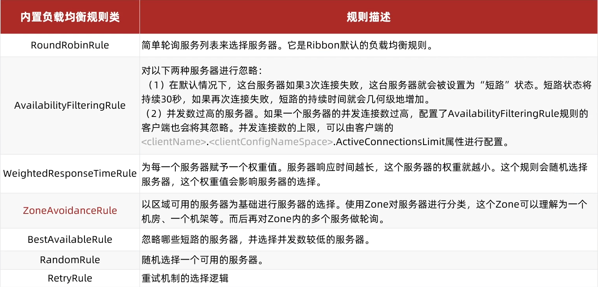

# Ribbon 负载均衡


## Ribbon 简介

​	对于上面客户端请求`http://userservice/user/`是不可能直接到达的，是由Ribbon拦截下来并且询问eureka服务端后才能找到对应的服务，@LoadBalanced注解的作用在这里，只要加了这个注解意味着这个服务发送的请求都要经过Ribbon拦截处理

​	源码原理就是从url中获取主机名即是服务名，传给一个RibbonLoadBanlancerClient类，由它调用DynamicServerListLoadBanlancer去eureka服务端拉取对应名字的服务列表，返回后继续调用IRule进行各种负载均衡的策略选择一个服务，最后返回给RibbonLoadBanlancerClient，其修改为真正的url然后发送请求


### 负载均衡策略

​	IRule的实现就是各种不同的负载均衡策略，常见的策略见下表



​	通过注入一个IRule接口的实现类就可以修改当前的负载均衡规则，这种方式是全局的，第二种方式是在每个服务中的yml配置文件里配置userservice（这里是指服务名，不是固定的）.ribbon.NFLoadBalancerRuleClassName，修改一个服务对另一个服务的负载均衡规则


### 饥饿加载

​	Ribbon默认是采用懒加载，即第一次访问时才会去创建LoadBalanceClient，请求时间很长，饥饿加载则会在项目启动时创建，通过下面的配置开启饥饿加载，注意是在服务的配置文件里面开启，LoadBalanceClient这个是在服务里的

```yaml
ribbon:
  eager-load:
    enabled: true  #开启饥饿加载
    clients: userservice  #指定对这个服务饥饿加载
```

