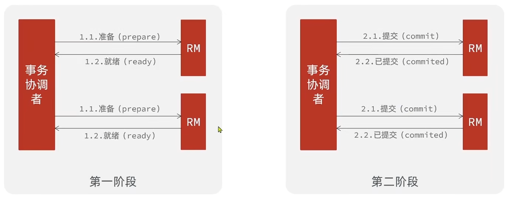
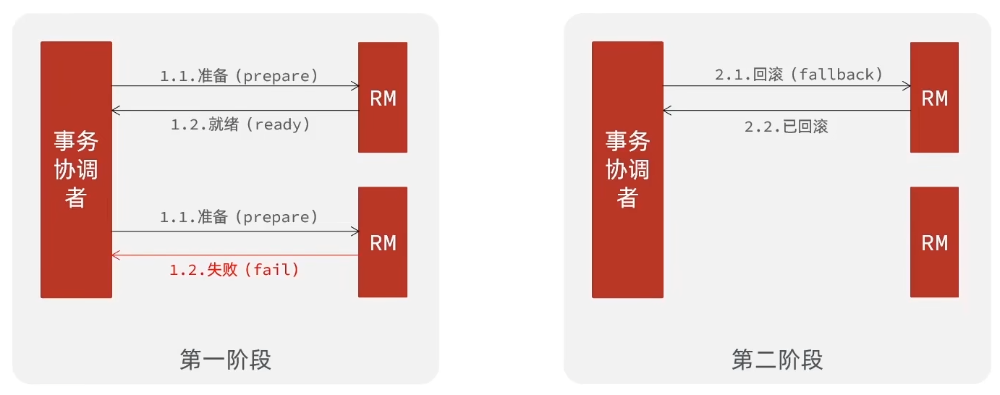
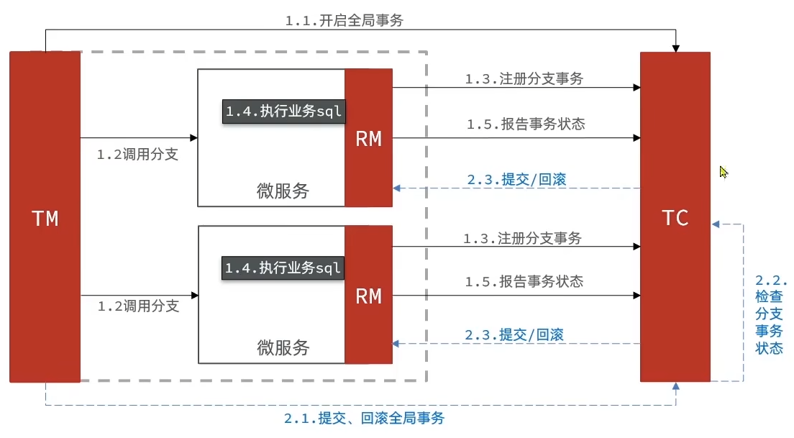
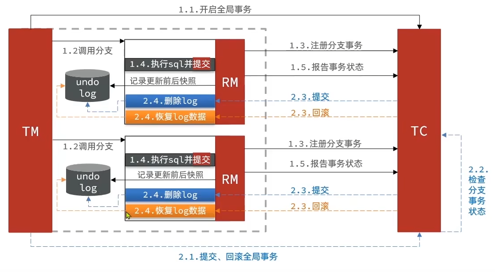
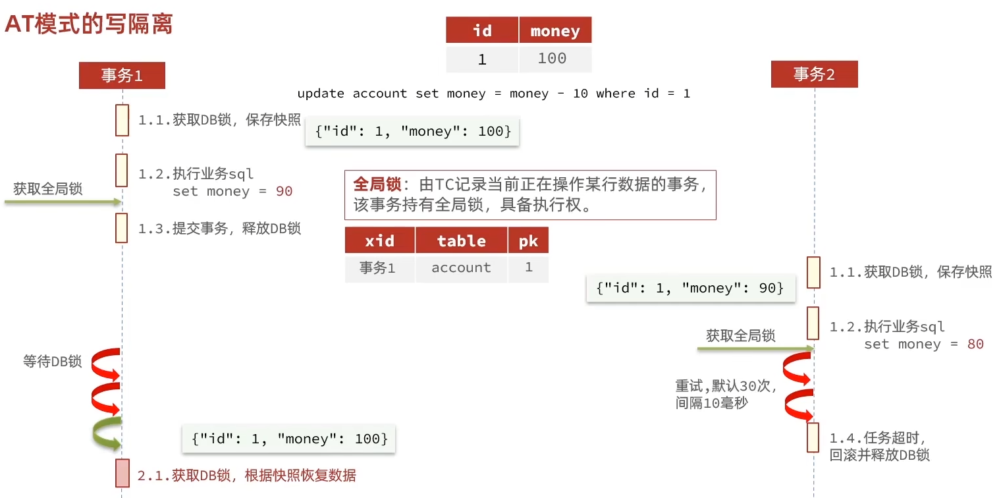
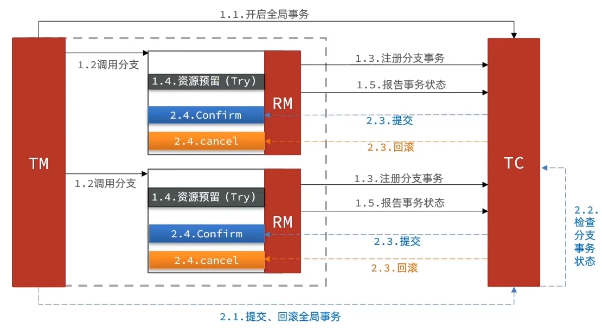
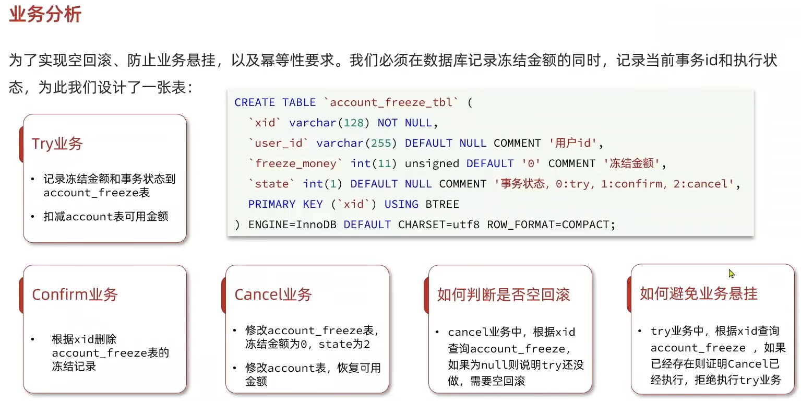
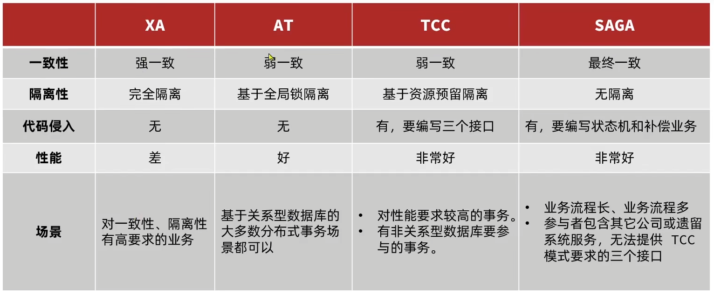

# 分布式事务

​	在分布式系统下，一个业务跨越多个服务或数据源，每个服务都是一个分支事务，要保证所有分支事务最终状态一致，

这样的事务就是分布式事务

​	

## 理论基础


### CAP 定理

​	1998年，加州大学的计算机科学家Eric Brewer提出，分布式系统有三个指标：

- Consistency （一致性）

- Availability （可用性）

- Partition tolerance （分区容错性）

​	Eric Brewer 说，分布式系统无法同时满足这三个指标，这个结论就叫做CAP定理

​	Consistency （一致性）：用户访问分布式系统中的任意节点，得到的数据必须一致

​	Availability （可用性）：用户访问集群中的任意健康节点，必须能得到响应，而不是超时或拒绝

​	Partition（分区）：因为网络故障或其它原因导致分布式系统中的部分节点与其它节点失去连接，形成独立分区

 	Tolerance（容错）：在集群出现分区时，整个系统也要持续对外提供服务


### BASE 理论

​	BASE理论是对CAP的一种解决思路，包含三个思想：

- Basically Available（基本可用）：分布式系统在出现故障时，允许损失部分可用性，即保证核心可用
- Soft State（软状态）：在一定时间内，允许出现中间状态，比如临时的不一致状态
- Eventually Consistent（最终一致性）：虽然无法保证强一致性，但是在软状态结束后，最终达到数据一致

​	而分布式事务最大的问题是各个子事务的一致性问题，因此可以借鉴CAP定理和BASE理论：

- AP模式：各子事务分别执行和提交，允许出现结果不一致，然后采用弥补措施恢复数据即可，实现最终一致
- CP模式：各个子事务执行后互相等待，同时提交，同时回滚，达成强一致，但事务等待过程中，处于弱可用状态

​	解决分布式事务，各个子系统之间必须能感知到彼此的事务状态，才能保证状态一致，因此需要一个事务协调者来协调每一个事务的参与者（子系统事务），子系统事务也称为分支事务，有关联的各个分支事务在一起称为全局事务


## Seata

​	Seata事务管理中有三个重要的角色：

- TC（Transaction Coordinator）事务协调者：维护全局和分支事务的状态，协调全局事务提交或回滚
- TM（Transaction Manager）事务管理器：定义全局事务的范围、开始全局事务、提交或回滚全局事务
- RM（Resource Manager）资源管理器：管理分支事务处理的资源，与TC交谈以注册分支事务和报告分支事务的状态，并驱动分支事务提交或回滚

​	Seata提供了四种不同的分布式事务解决方案：

- XA模式：强一致性分阶段事务模式，牺牲了一定的可用性，无业务侵入
- TCC模式：最终一致的分阶段事务模式，有业务侵入
- AT模式：最终一致的分阶段事务模式，无业务侵入，也是Seata的默认模式
- SAGA模式：长事务模式，有业务侵入


### 部署

​	安装后需要在conf目录下的registry.cong配置文件中配置一下注册中心和配置中心，然后就要去配置中心创建他的配置文件了，格式是properties，怎么配置就到时候用到的时候再去看官方文档吧，配置好后进入bin目录下运行seata-server.bat即可

​	微服务集成Seata的步骤：

1. 引入依赖

```xml
<dependency>
	<groupId>com.alibaba.cloud</groupId>
	<artifactId>spring-cloud-starter-alibaba-seata</artifactId>
</dependency>
```

2. 配置application.yml

```yaml
seata:
	registry:  # TC服务注册中心的配置，微服务根据这些信息去注册中心获取tc服务地址
	# 参考tc服务自己的registry.conf中的配置
	# 包括：地址、namespace、group、application-name、cluster
	type: nacos
	nacos:  # tc
		server-addr: 127.0.0.1:8848
		namespace: ""
		group: DEFAULT_GROUP
		application: seata-tc-server  # tc服务在nacos中的服务名称
		username: nacos
		password: nacos
	tx-service-group: seata-demo  # 事务组，根据这个获取tc服务的cluster名称，同一个组的事务是被同一个集群管理的
	service:
		vgroup-mapping:  # 事务组与TC服务cluster的映射关系
			seata-demo: ShangHai
```


### 模式


#### XA 模式

​	XA规范是x/Open组织定义的分布式事务处理（DTP，Distributed Transaction Processing）标准，XA规范描述了全局的TM与局部的RM之间的接口，几乎所有主流的数据库都对XA规范提供了支持





​	本质上就是依赖数据库的功能，所以属于强一致性的

​	seata的XA模式做了一些调整：



​	XA模式的优点：

- 事务的强一致性，满足ACID原则
- 常用数据库都支持，实现简单，并且没有代码侵入

​	缺点：

- 因为一阶段需要锁定数据库资源，等待二阶段结束才释放，性能较差
- 依赖关系型数据库实现事务


##### 实现

1. 修改application.yml文件，开启XA模式

```yml
seata:
	data-source-proxy-mode: XA  # 开启数据源代理的XA模式
```

2. 给发起全局事务的入口方法添加@GlobalTransactional注解


#### AT 模式

​	AT模式同样是分阶段提交的事务模型，不过却弥补了XA模型中资源锁定周期过长的缺陷



​	AT模式与XA模式的区别：

- XA模式一阶段不提交事务，锁定资源；AT模式一阶段直接提交，不锁定资源
- XA模式依赖数据库机制实现回滚；AT模式利用数据快照实现数据回滚
- XA模式强一致；AT模式最终一致

​	AT模式有脏写问题，当事务回滚前被另一个事务提前更改了数据就会发生，所以AT模式引入了写隔离：




AT模式的优点:

- 一阶段完成直接提交事务，释放数据库资源，性能比较好
- 利用全局锁实现读写隔离
- 没有代码侵入，框架自动完成回滚和提交

AT模式的缺点：

- 两阶段之间属于软状态，属于最终一致
- 框架的快照功能会影响性能，但比XA模式要好很多


##### 实现

1. 在TC服务关联的数据库里导入存全局锁的表，在微服务关联的数据库里导入存快照的表（这两个表都有相应的表结构）
2. 修改application.yml文件，开启AT模式

```yml
seata:
	data-source-proxy-mode: AT  # 开启数据源代理的AT模式
```


#### TCC 模式

​	TCC模式与AT模式非常相似，每阶段都是独立事务，不同的是TCC通过人工编码来实现数据恢复，需要实现三个方法：

- Try：资源的检测和预留（举个例子：先暂时冻结余额）

- Confirm：完成资源操作业务，要求Try成功Confirm一定要能成功

- Cancel：预留资源释放，可以理解为try的反向操作



​	TCC的优点：

- 一阶段完成直接提交事务，释放数据库资源，性能好
- 相比AT模型，无需生成快照，无需使用全局锁，性能最强
- 不依赖数据库事务，而是依赖补偿操作，可以用于非事务型数据库

​	TCC的缺点：

- 有代码侵入，需要人为编写try、Confirm和Cancel接口，太麻烦
- 软状态，事务是最终一致
- 需要考虑Confirm和Cancel的失败情况，做好幂等处理

​	实现TCC的要求：

- 保证confirm、cancel接口的幂等性
- 允许空回滚
- 拒绝业务悬挂

​	当某分支事务的try阶段阻塞时，可能导致全局事务超时而触发二阶段的cancel操作，而其它未执行的事务就需要在try操作时先执行了cancel操作，这时cancel不能做回滚，就是空回滚；对于已经空回滚的业务，如果突然阻塞畅通了继续执行try，就因为try操作锁定了资源但其已经不可能confirm或cancel，这就是业务悬挂，应当阻止执行空回滚后的try操作，避免悬挂

​	


##### 实现

​	TCC的Try、Confirm、Cancel方法都需要在接口中基于注解来声明

```java
@LocalTcc
public interface TCCService {
    // Try逻辑，@TwoPhaseBusinessAction中的name属性要与当前方法名一致，用于指定Try逻辑对应的方法
    @TwoPhaseBusinessAction(name = "prepare", commitMethod = "confirm", rollbackMehod = "cancel")
    void prepare(@BusinessActionContextParameter(paramName = "param") String param);
    // 二阶段confirm确认方法，可以另命名，但要保证与commitMethod里设置的一致
    boolean confirm(BusinessActionContext context);
    // 二阶段回滚方法，名字要保证与rollbackMehod里设置的一致
    boolean cancel(BusinessActionContext context)
}
```


#### Sega 模式

Saga模式是SEATA提供的长事务解决方案，也分为两个阶段:

- 一阶段：直接提交本地事务
- 二阶段：成功则什么都不做，失败则通过编写补偿业务来回滚

Saga模式优点：

- 事务参与者可以基于事件驱动实现异步调用，吞吐高
- 一阶段直接提交事务，无锁，性能好
- 不用编写TCC中的三个阶段，实现简单

缺点：

- 软状态持续时间不确定，时效性差
- 没有锁，没有事务隔离，会有脏写


#### 对比



