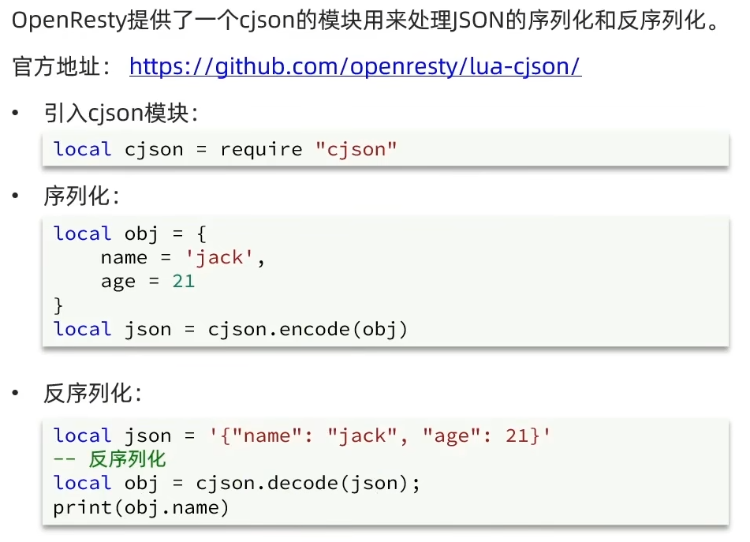

# 多级缓存

  ​	传统的缓存策略一般是请求到达Tomcat后，先查询Redis，如果未命中则查询数据库，存在下面的问题：

  - 请求要经过Tomcat处理，Tomcat的性能成为整个系统的瓶颈
  - Redis缓存失效时，会对数据库产生冲击

  ​	多级缓存就是充分利用请求处理的每个环节，分别添加缓存，减轻Tomcat压力，提升服务性能：

  

  

  ​	对于Tomcat服务器的进程缓存就需要使用JVM进程缓存，而nginx内部的编程就需要使用Lua语言

  

  ## JVM 进程缓存

  ​	缓存在日常开发中启动至关重要的作用，由于是存储在内存中，数据的读取速度是非常快的，能大量减少对数据库的访问，减少数据库的压力，我们把缓存分为两类：

  - 分布式缓存，例如Redis：

    - 优点：存储容量更大、可靠性更好、可以在集群间共享

    - 缺点：访问缓存有网络开销

    - 场景：缓存数据量较大、可靠性要求较高、需要在集群间共享

  - 进程本地缓存，例如HashMap、GuavaCache：

    - 优点：读取本地内存，没有网络开销，速度更快

    - 缺点：存储容量有限、可靠性较低、无法共享

    - 场景：性能要求较高，缓存数据量较小

  

  ### Caffeine

  ​	Caffeine是一个基于Java8开发的，提供了近乎最佳命中率的高性能的本地缓存库，目前Spring内部的缓存使用的就是Caffeine，GitHub地址: https://github.com/ben-manes/caffeine

  ​	通过下面的测试代码学习一下Caffeine的使用

  ```java
  // 创建缓存对象
  Cache<String, String> cache = Caffeine.newBuilder().build();
  // 存数据
  cache.put("a", "123");
  // 取数据
  String a = cache.getIfPresent("a");
  // 取数据，不存在则去数据库查询
  String defaultA = cache.get("defaultA", key -> {
      // 这里调用去数据库查询的代码然后将返回值return
  })
  ```

  ​	Caffeine提供了三种缓存驱逐策略：

  - 基于容量：设置缓存的数量上限

  ```java
  // 设置缓存大小上限为1
  Cache<String, String> cache = Caffeine.newBuilder().maximumSize(1).build();
  ```

  - 基于时间：设置缓存的有效时间

  ```java
  // 设置缓存有效期为10秒，从最后一次写入开始计时
  Cache<String, String> cache = Caffeine.newBuilder().expireAfterWrite(Duration.ofSeconds(10));
  ```

  - 基于引用：设置缓存为软引用或弱引用，利用GC来回收缓存数据，性能较差，不建议使用

  ​	在默认情况下，当一个缓存元素过期的时候，Caffeine不会自动立即将其清理和驱逐，而是在一次读或写操作后，或者在空闲时间完成对失效数据的驱逐

  

  ## Lua 语法

  ​	Lua是一种轻量小巧的脚本语言，用标准C语言编写并以源代码形式开放，其设计目的是为了嵌入应用程序中，从而为应用程序提供灵活的扩展和定制功能，官网：https://www.lua.orgl/

  ​	这里跳，比较简单而且学过

  

  ## OpenResty

  ​	OpenResty是一个基于Nginx的高性能Web平台，用于方便地搭建能够处理超高并发、扩展性极高的动态Web应用、Web服务和动态网关，具备下列特点:

  - 具备Nginx的完整功能
  - 基于Lua语言进行扩展，集成了大量精良的Lua库、第三方模块
  - 允许使用Lua自定义业务逻辑、自定义库

  ​	安装过程省略，需要用的时候再去找教程

  

  ​	

  ### 快速入门

  

  注意：nginx.conf是OpenResty文件夹里的，因为它就是基于nginx的也有nginx的配置文件

  

  

  ### 获取请求参数

  

  

  ## 查询 Tomcat 服务器

  

  

  ​	JSON结果处理：

  

  ​	实际中可能Tomcat服务器不止一台，得负载均衡，像下面这样设置就好了

  

  ​	默认的策略是轮询，不太适合缓存，这样会导致多台Tomcat里的进程缓存会有冗余的数据，使用hash $request_uri可以使对每个请求uri进行hash算法后对Tomcat服务器的数量取模，以后对于这个uri都会去访问同一台服务器

  

  ## 添加 Redis 缓存的需求

  ​	按最初的结构图，OpenResty不是直接就查询Tomcat服务器，而是优先到redis查询，redis缓存未命中时才会去查询Tomcat

  ​	**冷启动**：服务刚刚启动时，Redis中并没有缓存，如果所有商品数据都在第一次查询时添加缓存，可能会给数据库带来较大压力。

  ​	**缓存预热**：在实际开发中，我们可以利用大数据统计用户访问的热点数据，在项目启动时将这些热点数据提前查询并保存到Redis中

  ​	缓存预热步骤：

  1. 利用Docker安装Redis

  ```bash
  docker run --name redis -p 6379:6379 -d redis redis-server --appendonly yes
  ```

  2. 在微服务中引入Redis依赖

  ```xml
  <dependency>
  	<groupId>org.springframework.boot</groupId>
      <artifactId>spring-boot-starter-data-redis</artifactId>
  </dependency>
  ```

  3. 配置redis地址

  ```yaml
  spring:
  	redis:
  		host: 192.168.150.101
  ```

  4. 编写初始化类

  ```java
  @Component
  public class RedisHandler implements InitializingBean {
  	@Autowired
      private StringRedisTemplate redisTemplate;
      @Override
      public void afterPropertiesSet() throws Exception {
          // 初始化缓存的代码
      }
  }
  ```

  ​	OpenResty的Redis模块

  

  

  

  

  ## Nginx 本地缓存

  ​	在多级缓存的结构里还剩OpenResty的本地缓存还没实现，当反向代理来的时候优先访问nginx本地缓存，然后才会去查redis缓存

  

  

  ## 缓存同步

  ​	缓存数据同步的常见方式有三种：

  - 设置有效期：给缓存设置有效期，到期后自动删除，再次查询时更新

    - 优势：简单、方便

    - 缺点：时效性差，缓存过期之前可能不一致

    - 场景：更新频率较低，时效性要求低的业务

  - 同步双写：在修改数据库的同时，直接修改缓存

    - 优势：时效性强，缓存与数据库强一致

    - 缺点：有代码侵入，耦合度高

    - 场景：对一致性、时效性要求较高的缓存数据

  - 异步通知：修改数据库时发送事件通知，相关服务监听到通知后修改缓存数据

    - 优势：低耦合，可以同时通知多个缓存服务

    - 缺点：时效性一般，可能存在中间不一致状态

    - 场景：时效性要求一般，有多个服务需要同步

  

  

  

  ## Canal

  ​	Canal是阿里巴巴旗下的一款开源项目，基于Java开发，基于数据库增量日志解析，提供增量数据订阅&消费，GitHub的地址: https://github.com/alibaba/canal

  ​	Canal是基于mysql的主从同步来实现的，MySQL主从同步的原理如下:

  - MySQL master将数据变更写入二进制日志（ binary log），其中记录的数据叫做binary log events
  - MySQL slave 将 master的 binary log events拷贝到它的中继日志（relay log）
  - MySQL slave重放relay log中事件，将数据变更反映它自己的数据

  ​	Canal就是把自己伪装成MySQL的一个slave节点，从而监听master的binary log变化，再把得到的变化信息通知给Canal的客户端，进而完成对其它数据库的同步

  ​	搭建步骤：

  1. 在mysql的conf目录下修改my.cnf配置文件

  ```ini
  log-bin=数据存放路径
  binlog-do-db=监控的是哪个数据库
  ```

  2. 在数据库中添加一个仅用于数据同步的账户
  3. 重启mysql
  4. 在docker创建网络，将SQL、Canal、MQ放到同一个网络中
  5. 运行canal并创建canal容器

  ​	缓存同步实现：

  

  1. 引入依赖，官方的不好用，这里是第三方依赖

  ```xml
  <dependency>
  	<groupId>top.javatool</groupId>
      <artifactId>canal-spring-boot-starter</artifactId>
  </dependency>
  ```

  2. 编写配置

  ```yaml
  canal:
  	destination: canal实例名称，跟canal-server运行时设置的destination一致
  	server: canal地址
  ```

  3. 编写监听器，监听Canal消息

  ```java
  @CanalTable("tb_item")  // 指定要监听的表
  @Component
  public class ItemHandler implements EntryHandler<Item> {  // 范型为表监听的实体类
      
      @Override
      public void insert(Item item) {
          // 新增数据到redis
          // 新增本地缓存
      }
      
      @Override
      public void update(Item before, Item after) {
          // 更新redis数据
          // 更新本地缓存
      }
      
      @Override
      public void delete(Item item) {
          // 删除redis数据
          // 清除本地缓存
      }
  }
  
  // 另外对于被监听的实体类，也得加一些注解
  @Id  // 标记表中的id字段
  @Column  // 标记表中与属性名不一致的字段
  @Transient  // 标记不属于表中的字段
  ```

  
